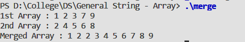

#### Objective:

Write a program to merge two sorted arrays.

#### Code :

```cpp
#include <stdio.h>

int merge(int a[] , int b[], int c[] , int lena , int lenb);

int main() {
    int c[20];
    int a[] = {1,2,3,7,9,};
    int b[] = {2,4,5,6,8,};

    merge(a,b ,c, 5 ,5);

    printf("1st Array : ");
    for(int i = 0 ; i < 5 ; i++){
        printf("%d " , a[i]) ;
    }
    printf("\n");    

    printf("2nd Array : ");    
    for(int i = 0 ; i < 5 ; i++){
        printf("%d " , b[i]) ;
    }
    printf("\n");

    printf("Merged Array : ");
    for(int i = 0 ; i < 10 ; i++){
        printf("%d " , c[i]) ;
    }


}

int merge(int a[] , int b[], int c[] , int lena , int lenb){

    int c1 = 0 ;
    int c2 = 0 ;
    int i = 0 ;
    while(c1 < lena && c2 < lenb){
        if(a[c1] > b[c2]) {
            c[i++] = b[c2++] ;
        } else {
            c[i++] = a[c1++] ;
        }
    }
    while(i < lena  + lenb ) {
        if(c1<lena) {
            c[i++] = a[c1++] ;
        } else {
            c[i++] = b[c2++] ;
        }
    }
}

```

#### Output : 




