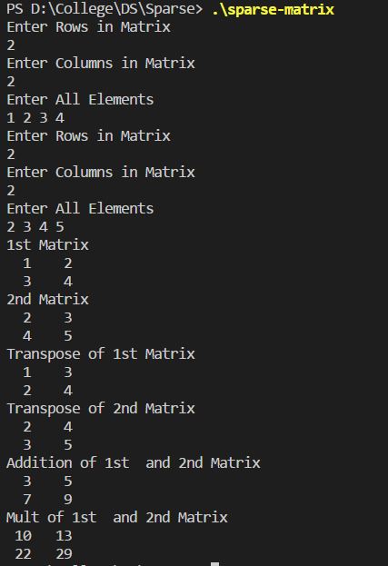

#### Objective:

Write a program to implement the a 2D Matrix as a **Sparse Matrix** and perform transform, addition and multiplication operations on it.

#### Code :

```cpp
#include <iostream>
#include <iomanip>

using namespace std ;

struct sparse {
    int row ;
    int col ;
    int value ;
} ;

void sparse_input( sparse[] );
void sparse_display( sparse[] );

void sparse_transpose(sparse[] , sparse[]);
void sparse_addition(sparse[] , sparse[] , sparse[]);
void sparse_multiplication(sparse[] , sparse[] , sparse[]);


int main() {
    
    sparse m1[20] , m2[20] , m3[20] , m4[20] , m5[20];
    
    sparse_input( m1 );
    sparse_input( m2 );
    
    cout << "1st Matrix" << endl ;
    sparse_display( m1 );
    
    cout << "2nd Matrix" << endl ;
    sparse_display( m2 );
    
    cout << "Transpose of 1st Matrix" << endl ;
    sparse_transpose( m1 , m3 );
    sparse_display( m3 );

    cout << "Transpose of 2nd Matrix" << endl ;
    sparse_transpose( m2 , m3 );
    sparse_display( m3 );
    
    cout << "Addition of 1st  and 2nd Matrix" << endl ;
    sparse_addition(m1 , m2 , m4);
    sparse_display(m4) ;
    
    cout << "Mult of 1st  and 2nd Matrix" << endl ;
    sparse_multiplication(m1 , m2 , m5);
    sparse_display(m5) ;
    
    return 0 ;
}


void sparse_input(sparse matrix[]) {
    
    int row , col , elem , k;
    
    cout << "Enter Rows in Matrix" << endl ;
    cin >> matrix[0].row ;
    cout << "Enter Columns in Matrix" << endl ;
    cin >> matrix[0].col ;
    
    cout << "Enter All Elements" << endl ;
    
    k = 1 ;
    
    for( int i = 0 ; i < matrix[0].row ; i++ ){
        
        for( int j = 0 ; j < matrix[0].col ; j++ ){
            cin >> elem ;
            if (elem != 0 ){
                matrix[k].row = i ;
                matrix[k].col = j ;
                matrix[k].value = elem ;
                k++ ;
            }
        }
        
    }
    
    matrix[0].value = k - 1 ;
    
}

void sparse_display(sparse matrix[]) {
    
    int k = 1;
    
    for( int i = 0 ; i < matrix[0].row ; i++ ){
        
        for( int j = 0 ; j < matrix[0].col ; j++ ){
            
            if ( k <= matrix[0].value && matrix[k].row == i && matrix[k].col == j ){
                cout << setw(3) << matrix[k].value ; 
                k++ ;             
            }
            else {
                cout << setw(3) << 0 ; 
            }
            cout << "  " ;
        }
        cout << endl ;
    }
    
}

void sparse_transpose(sparse matrix[] , sparse transpose[]){
    int c[20] , d[20] , i , m , n , t ;
    m = matrix[0].row ;
    n = matrix[0].col ;
    t = matrix[0].value ;
    
    transpose[0].row = n ;
    transpose[0].col = m ;
    transpose[0].value = t ;
    
    for( i = 0 ; i < n ; i++ ) {
        c[i] = 0 ;
    }
    for( i = 1 ; i <= t ; i++ ) {
        c[ matrix[i].col ] ++ ;
    }
    d[0] = 1 ;
    for( i =1 ; i < n ; i++ ){
        d[i] = d[i-1] + c[i-1] ;
    }
    
    for( int i = 1 ; i <=t ; i++ ){
        transpose[ d[matrix[i].col] ].row = matrix[i].col ;
        transpose[ d[matrix[i].col] ].col = matrix[i].row ;
        transpose[ d[matrix[i].col] ].value = matrix[i].value ;
        
        d[matrix[i].col]++ ;
    }
    
}

void sparse_addition(sparse A[] , sparse B[] , sparse C[] ){
    
    int i = 1 ;
    int j = 1 ;
    int k = 1;
    
    if ( A[0].row != B[0].row || A[0].col != B[0].col  ) {
        cout << "Addition Not Possible" << endl ;
        return ;
    }
    
    while( i <= A[0].value && j <= B[0].value ){
        
        if ( ( A[i].row < B[j].row ) || ( A[i].row == B[j].row && A[i].col < B[j].col ) ){
            C[k].row = A[i].row ;
            C[k].col = A[i].col ;
            C[k].value = A[i].value ;
            i++ ;
            k++ ;
        }
        else if ( ( A[i].row > B[j].row ) || ( A[i].row == B[j].row && 
        A[i].col > B[j].col ) ){
            C[k].row = B[j].row ;
            C[k].col = B[j].col ;
            C[k].value = B[j].value ;
            j++ ;
            k++ ;
        }
        else {
            C[k].row = A[i].row ;
            C[k].col = A[i].col ;
            C[k].value = A[i].value + B[j].value;
            i++ ;
            j++ ;
            k++ ;
        }
        
    }
    
    while ( i <= A[0].value ) {
        C[k].row = A[i].row ;
        C[k].col = A[i].col ;
        C[k].value = A[i].value ;
        i++ ;
        k++ ;
    }
    
    while (j <= B[0].value) {
        C[k].row = B[j].row ;
        C[k].col = B[j].col ;
        C[k].value = B[j].value ;
        j++ ;
        k++ ;
    }
    
    C[0].row = A[0].row ;
    C[0].col = A[0].col ;
    C[0].value = k-1 ;
    
    return ;
    
    
}

void sparse_multiplication(sparse A[] , sparse B[] , sparse C[]){
    
    sparse transposeB[20] ;
    
    // Sqaure Matrix Only;
    
    sparse_transpose(B , transposeB) ;
    
    
    
    int c[20] , d[20] ,e[20] , i , j, m , n , t  ,temp , iter , iterB, row , col , k;
    m = transposeB[0].row ;
    n = transposeB[0].col ;
    t = transposeB[0].value ;
    k = 1 ;
    
    for( i = 0 ; i < n ; i++ ) {
        c[i] = 0 ;
    }
    for( i = 1 ; i <= t ; i++ ) {
        c[ transposeB[i].row ] ++ ;
    }
    d[0] = 1 ;
    for( i =1 ; i < n ; i++ ){
        d[i] = d[i-1] + c[i-1] ;
    }
    
    
    for( i = 0 ; i < n ; i++ ) {
        c[i] = 0 ;
    }
    for( i = 1 ; i <= t ; i++ ) {
        c[ A[i].row ] ++ ;
    }
    e[0] = 1 ;
    for( i =1 ; i < n ; i++ ){
        e[i] = e[i-1] + c[i-1] ;
    }

    
    for( i = 0 ; i < m ; i++){
        for ( j = 0 ; j < n ; j++) {
            row = i ;
            col = j ;
            
            iter = e[row] ;
            iterB = d[col] ;
            // cout << iter << iterB <<endl;
            temp = 0 ;
            while( A[iter].row == row && transposeB[iterB].row == col ) {
                
                if ( transposeB[iterB].col == A[iter].col) {
                    temp += transposeB[iterB].value * A[iter].value ;
                    iter ++ ;
                    iterB ++ ; 
                } 
                else if ( transposeB[iterB].col < A[iter].col ) {
                    iterB ++ ;
                } else {
                    iter++ ;
                }
                
            }
            
            if (temp != 0 ){
                C[k].row = row ;
                C[k].col = col ;
                C[k].value = temp ;
                k++ ;
            }
        }
    }
    
    C[0].row = n ;
    C[0].col = n ;
    C[0].value = k-1 ;   
}
```

#### Output : 




