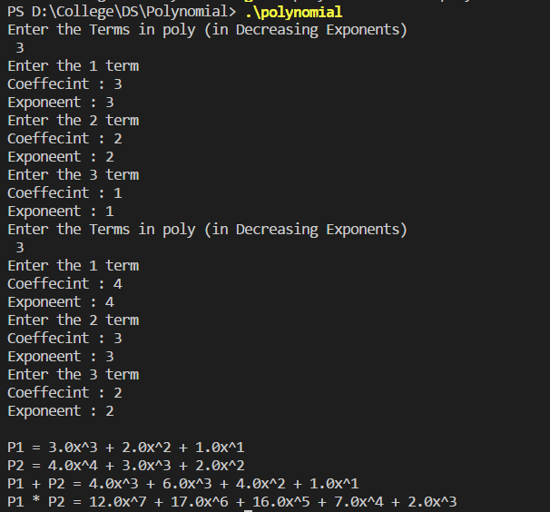

#### Objective:

Write a program to implement in Polynomial Addition and Multiplication

#### Code :

```cpp
#include <stdio.h>

typedef struct {
    float coeff ;
    int exp ;
} poly ;

void inputPoly(poly[] , int*) ;
void displayPoly(poly[] , int) ;
void copyPoly(poly[] , poly[] , int) ;
void addPoly(poly[] ,poly[] , poly[] , int , int , int* ) ;
void multerm( poly[] , poly[] , int, int , int );
void mulPoly( poly[] , poly[] , poly[] , int, int , int* );
    
int main(){
    int S1 , S2 , S3  , S4;
    poly P1[20] , P2[20] , P3[20] , P4[20] ;
    
    inputPoly( P1 , &S1 ) ;
    inputPoly( P2 , &S2 ) ;

    printf("\n");
    
    printf("P1 = ") ;
    displayPoly(P1 , S1) ;
    printf("P2 = ") ;  
    displayPoly(P2 , S2) ;
    
    printf("P1 + P2 = ");
    addPoly(P1 , P2 , P3 , S1 ,S2 , &S3) ;    
    displayPoly(P3 , S3) ;

    printf("P1 * P2 = ");
    mulPoly(P1 , P2 , P4 , S1 ,S2 , &S4) ;    
    displayPoly(P4 , S4) ;
  
  	return 0;
}
void inputPoly(poly P[] , int* S){
    
    printf("Enter the Terms in poly (in Decreasing Exponents) \n ");
    scanf("%d" , S) ;
    for( int i = 0 ; i < *S ; i++ ){
        printf("Enter the %d term \n" , i+1);
        printf("Coeffecint : ") ;
        scanf("%f" , &P[i].coeff) ;
        printf("Exponeent : ") ;
        scanf("%d" , &P[i].exp) ;
    }
}

void displayPoly(poly P[] , int S){
    
    for( int i = 0 ; i < S ; i++ ){
        printf("%0.1fx^%d" , P[i].coeff, P[i].exp) ;
        if(i < S-1 )
            printf(" + ");
    }
    printf("\n");
}

void addPoly(poly P1[] , poly P2[]  ,poly P3[] ,  int S1,int S2,int* S3 ){
    
    int i,j,k;
    i=j=k=0;

    while( i < S1 && j < S2){
        if( P1[i].exp == P2[j].exp ){
            P3[k].exp = P1[i].exp ;
            P3[k++].coeff = P1[i++].coeff + P2[j++].coeff ;
        }
        else if( P1[i].exp > P2[j].exp ){
            P3[k].exp = P1[i].exp ;
            P3[k++].coeff = P1[i++].coeff ;
        }
        else if( P1[i].exp < P2[j].exp ){
            P3[k].exp = P1[j].exp ;
            P3[k++].coeff = P2[j++].coeff ;
        }
    }
    while( i < S1 ){
        P3[k].exp = P1[i].exp ;
        P3[k++].coeff = P1[i++].coeff ;
    }
    while( j < S2 ){
        P3[k].exp = P2[j].exp ;
        P3[k++].coeff = P2[j++].coeff ;
    }
    *S3 = k ;
    
}

void copyPoly( poly P1[] , poly P2[] , int s ){

    for( int i = 0 ; i < s  ; i++ ){
        P2[i].coeff = P1[i].coeff ;
        P2[i].exp = P1[i].exp ;
    }
}

// P2 = P1 * (c*x^e)

void multerm( poly P[] , poly A[] , int c, int e , int s1  ){
    for( int i = 0 ; i < s1 ; i++ ){
        A[i].exp = P[i].exp + e ;
        A[i].coeff = P[i].coeff * c ;
    }
}

void mulPoly( poly P1[] , poly P2[] , poly P3[] , int s1 , int s2 , int* s3 ){

    poly P4[20] , P5[20] ;
    int s4 , s5 ;
    *s3 = 0 ;
    s4 = s2 ;
    for( int i = 0 ; i < s1 ; i++ ){
        multerm( P2 , P4 , P1[i].coeff , P1[i].exp , s2  ) ;
        addPoly( P3 , P4 , P5 , *s3 , s2 , &s5 ) ;
        copyPoly( P5 , P3 , s5 ) ;
        *s3 = s5 ;    
    }
}
```

#### Output : 




