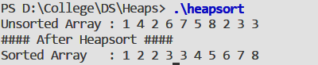

#### Objective:

To implement Heap Sort Algorithm on a unsorted array.

#### Code :

```cpp
#include <stdio.h>
#define LENGTH 10

int heapSize;

void Heapify(int* A, int i)
{
    int l = 2 * i + 1;
    int r = 2 * i + 2;
    int largest;
    
    if(l <= heapSize && A[l] > A[i]) {
        largest = l;        
    }
    else {
        largest = i;
    }
    if(r <= heapSize && A[r] > A[largest]) {
        largest = r;        
    }
    
    if(largest != i) {
        int temp = A[i];
        A[i] = A[largest];
        A[largest] = temp;
        Heapify(A, largest);
    }
}

void BuildHeap(int* A)
{
    heapSize = LENGTH - 1;
    for(int i = (LENGTH - 1) / 2; i >= 0; i--)
    Heapify(A, i);
}

void HeapSort(int* A)
{
    BuildHeap(A);
    int i;
    for(i = LENGTH - 1; i > 0; i--)
    {
        int temp = A[heapSize];
        A[heapSize] = A[0];
        A[0] = temp;
        heapSize--;
        Heapify(A, 0);
    }
}

int main()
{
    int tab[LENGTH] = {1,4,2,6,7,5,8,2,3,3};
    printf("Unsorted Array : ");
    for(int i = 0; i < LENGTH; i++){
        printf("%d ",tab[i]);        
    }
    printf("\n#### After Heapsort #### \n");
    HeapSort(tab);
    printf("Sorted Array   : ");
    for(int i = 0; i < LENGTH; i++){
        printf("%d ",tab[i]);        
    }
    return 0;
}
```

#### Output : 




