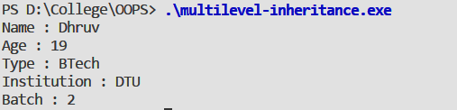

#### Aim:

To understand the concept of Multilevel Inheritance and implement it with the help of on example.

#### Theory:

One of the most important concepts in object-oriented programming is that of inheritance. Inheritance allows us to define a class in terms of another class, which makes it easier to create and maintain an application. This also provides an opportunity to reuse the code functionality and fast implementation time.  When creating a class, instead of writing completely new data members and member functions, the programmer can designate that the new class should inherit the members of an existing class. This existing class is called the **base class**, and the new class is referred to as the **derived class**. In Multilevel Inheritance, a derived class can also inherited by another class. For instance, if we inherit Base class in Derived1 class and inherit Derived1 class in Derived2 class. So when a derived is inherited by another class then it creates Multiple Levels and this is known as **Multi-level Inheritance**.

#### Syntax :

```cpp
class A { 
	// Base class
}; 
class B: public A {
	// B derived from A
}; 
class C: public B {
   // C derived from B 
}; 
```

#### Code :

```cpp
#include <iostream>
#include <string.h>
using namespace std ;

class Person {

    protected :
    char name[50] ;
    int age ;

    public :
    Person( char* s , int a ) {
        strcpy( name,s );
        age = a ; 
    }

    void display() {
        cout << "Name : " << name << endl ;
        cout << "Age : " << age << endl ;
    }

};

class Student : public Person  {

    protected :
    char type[10] ;
    char clg_name[50] ;

    public :
    Student( char *s  , int a , char *t , char *cn ) : Person( s , a ) {
        strcpy( type , t );
        strcpy( clg_name , cn );
    }

    void display() {
        Person :: display() ;
        cout << "Type : " << type << endl ;
        cout << "Institution : " << clg_name << endl ;
    }

} ;

class BTech : public Student {
    private :
    int batch ;

    public :
    BTech( char *s  , int a , char *t , char *cn , int b  ) : Student( s, a, t ,cn  ){
        batch = b ;
    }

    void display() {
        Student :: display () ;
        cout << "Batch : " << batch <<endl ;
    }
};

int main(){

    BTech var( "Dhruv" , 19 , "BTech" , "DTU" , 2  );
    var.display(); 

}
```

#### Output : 


#### Discussion :

The above program illustrates the concept of multilevel inheritance. In this program, a `Person` class is made which has marks as a data member and a constructor to accept data. Class `Person` is inherited publically in derived class `Student` which accepts data and calls the constructor of `Person` . `Student ` is inherited by `BTech` . This way a multilevel inheritance is carried out.


#### Learning Outcomes :
- Multilevel inheritance allows user to inherit classes in a level wise order.
- Reusability - facility to use public methods of base class without rewriting the same.
- Extensibility - extending the base class logic as per business logic of the derived class.
- Data Hiding - base class can decide to keep some data private so that it cannot be altered by the derived class
- Overriding -With inheritance, we will be able to override the methods of the base class so that meaningful implementation of the base class method can be designed in the derived class.


