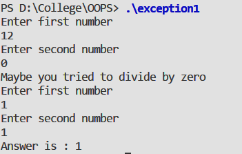

#### Aim:

To write a program to demonstrate Exception Handling in C++ by : 

- Division by zero.
- Array index out of bounds exception using multiple catch blocks.

#### Theory:

An exception is a problem that arises during the execution of a program. A C++ exception is a response to an exceptional circumstance that arises while a program is running, such as an attempt to divide by zero.

Exceptions provide a way to transfer control from one part of a program to another. C++ exception handling is built upon three keywords: try, catch, and throw.

- **throw** − A program throws an exception when a problem shows up. This is done using a throw keyword.
- **catch** − A program catches an exception with an exception handler at the place in a program where you want to handle the problem. The catch keyword indicates the catching of an exception.
- **try** − A try block identifies a block of code for which particular exceptions will be activated. It's followed by one or more catch blocks.

#### Syntax :

```cpp
try {
   // protected code
} catch( ExceptionName e1 ) {
   // catch block
} catch( ExceptionName e2 ) {
   // catch block
} catch( ExceptionName eN ) {
   // catch block
}
```

#### Code :

##### Part 1

```cpp
#include <iostream>
using namespace std;
 
int main()
{   int a,b,c;
    bool done = false;
    
    do
    {   cout << "Enter first number" << endl;
        cin >> a;
        
        cout << "Enter second number" << endl;
        cin >> b;
        
        try
        {   if (b == 0)
            throw "error";
            c = a/b;
            cout <<"Answer is : "<< c << endl;
            done = true;
        }
        catch(...)
        {   cout << "Maybe you tried to divide by zero"<<endl;
        }
    }
    while (! done);
    return 0;
}

```

##### Part 2

```cpp
#include <iostream>
using namespace std;
int main () {
    try
    {
        char * mystring;
        mystring = new char [10];
        if (mystring == NULL) throw "Allocation failure";
        for (int n=0; n<=100; n++)    {
            if (n>9) throw n;
            mystring[n]='z';
        }
    }
    catch (int i)
    {cout << "Exception: ";
        cout << "index " << i << " is out of range" << endl;  }
    
    catch (char * str)
    { cout << "Exception: " << str << endl;   }
    return 0;
}
```


#### Output : 




#### Discussion :

When the try block throws an exception, the program control leaves the try block and enters the catch statement of the catch block. Note that exceptions are objects used to transmit information about a problem. If the type of object thrown matches the argument type in the catch statement, then catch block is executed for handling the exception. If they do not match, the program is aborted with the help of `abort()` function which is invoked by default. When no exception is detected and thrown, the control goes to the statement immediately after the catch block.


#### Learning Outcomes :
- C++ exception handling mechanism is basically build upon three keywords namely. Try, throw, catch.
- The keyword try is used to preface a block of statements which may generate exceptions. This block of statements is known as try block. 
- When an exception is detected, it is thrown using a throw statement in the try block.
- A catch block defined by the keyword catch, catches the exception thrown by the throw statement in the try block, it handles is appropriately. 


