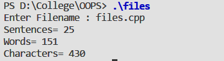

#### Aim:

Write a program to show file handling and count number of words , characters and sentences.

#### Theory:

**File** : The information / data stored under a specific name on a storage device, is called a file.

**Stream**: It refers to a sequence of bytes.

**Text file**: It is a file that stores information in ASCII characters. In text files, each line of text is terminated with a special character known as EOL (End of Line) character or delimiter character. When this EOL character is read or written, certain internal translations take place.

**Binary file**: It is a file that contains information in the same format as it is held in memory. In binary files, no delimiters are used for a line and no translations occur here.   

Classes for file stream operation :

- **ofstream**: Stream class to write on files
- **ifstream**: Stream class to read from files
- **fstream**: Stream class to both read and write from/to files.

#### Syntax :

```cpp
// OPENING FILE USING CONSTRUCTOR
ofstream outFile("sample.txt");    //output only
ifstream inFile("sample.txt");  //input only
 
// OPENING FILE USING open()
Stream-object.open(“filename”, mode)
      ofstream outFile;
      outFile.open("sample.txt");
     
      ifstream inFile;
      inFile.open(“sample.txt”);
 
// ClOSING FILE
   outFile.close();
   inFile.close();
```

#### Code :

```cpp
#include<iostream>
#include<fstream>
using namespace std;
int main(){
    ifstream fin;
    char filename[20];
    cout<< "enter filename: ";
    gets(filename);
    fin.open(filename);
    int line=0,word=0,chars=0;
    char ch;
    fin.seekg(0,ios::end);
    fin.seekg(0,ios::beg);
    while(fin){
        fin.get(ch);
        if(ch!=' ' && ch!='\n') ++chars;
        if(ch==' '|| ch=='\n') ++word;
        if(ch=='\n')  ++line;
        
    }
    cout<< "Sentences= "<<line<< "\nWords= "<<word<< "\nCharacters= "<<chars<<endl;
    fin.close(); // closing file
    return 0;
}
```

#### Output : 


#### Discussion :

The program opens a file named files.cpp and reads it till the end of the file is reached and during reading it counts the number of words, characters and sentences present in the file. Function `open()` is used to open a file and `close()` disconnects the file from the stream `object.seekg()` moves the get pointer (input) to a specified location.


#### Learning Outcomes :
- Here we learned the concept of file handling to read and write data in a file.
- Files are a means to store data in a storage device.
- C++ file handling provides a mechanism to store output of a program in a file and read from a file on the disk. 
- A file can be opened in different modes to perform read and write operations. 


