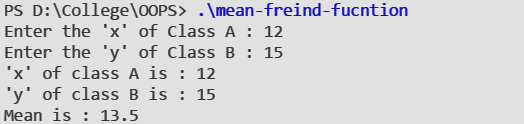

#### Aim:
To understand the concept of **Friend Functions** with the help of on example.
#### Theory:
A friend function of a class is defined outside that class' scope but it has the right to access all private and protected members of the class. Even though the prototypes for friend functions appear in the class definition, friends are not member functions.

A friend can be a function, function template, or member function, or a class or class template, in which case the entire class and all of its members are friends.

To declare a function as a friend of a class, precede the function prototype in the class definition with keyword `friend` .

#### Syntax :

```cpp
class A {
   //data members
   
   public:
      friend void name( A a );
      //body
};

```

#### Code :

```cpp
#include <iostream>

using namespace std ;


class B ;

class A {
    int x ;
    public :
        void input(){
            cout << "Enter the 'x' of Class A : "  ;
            cin >> x ;
        }
        void display() {
            cout << "'x' of class A is : " << x << endl;
        }
        friend float mean( A , B) ;
} ;
class B {
    int y ;
    public :
        void input(){
            cout << "Enter the 'y' of Class B : " ;
            cin >> y ;
        }
        void display() {
            cout << "'y' of class B is : " << y << endl;
        }
        friend float mean( A , B) ;
} ;

float mean(A a , B b){
    return (a.x + b.y)/ 2.0 ;
}

int main(){
    A a;
    B b;

    a.input() ;
    b.input() ;

    a.display() ;
    b.display() ;

    cout << "Mean is : " <<  mean(a,b) << endl;

    return 0;
}


```

#### Output : 
 
 

#### Discussion :
The program demonstrates the concept of friend function using the class `A` and `B`. The function `mean` is friend of both classes and can access the private members of both the classes. The function calculates the mean of data members and returns it.

#### Learning Outcomes :
- Provides additional functionality which is kept outside the class.
- Provides functions that need data which is not normally used by the class.
- Allows sharing private class information by a non member function.


