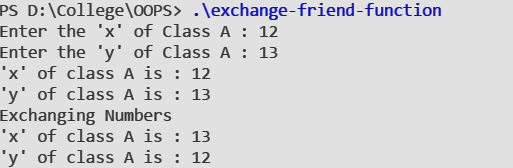

#### Aim:
To understand the concept of **Pointers in Classes** with the help of an example.
#### Theory:
Just like pointers to normal variables and functions, we can have pointers to class member functions and member variables. The members must be public for pointers to exist.
##### Pointer to Data Members
We can use pointer to point to class's data members (Member variables).
`datatype class_name::*pointer_name =  class_name::datamember_name ;`

##### Pointer to Member Functions
Pointers can be used to point to class's Member functions.
`return_type (class_name::*ptr_name) (argument_type) = &class_name::function_name ;`


#### Syntax :

```cpp
class A {
   //data members
   
   public:
      //body
};

// Pointer to Member Function
int* (A::* ptr)() = &A::func  ;

//Pointer to Data Member
int A::*ptr = &A::x;

```

#### Code :

```cpp
#include <iostream>

using namespace std ;

class A {
    int x ;
    int y ;
    public :
        void input(){
            cout << "Enter the 'x' of Class A : "  ;
            cin >> x ;
            cout << "Enter the 'y' of Class A : "  ;
            cin >> y ;
        }
        void display() {
            cout << "'x' of class A is : " << x << endl;
            cout << "'y' of class A is : " << y << endl;
        }
        int* getXPtr(){
            return &x ;
        }
        int* getYPtr(){
            return &y ;
        }
        friend void exchange(A) ;
} ;

int* (A::* ptrx)() = &A::getXPtr ;
int* (A::* ptry)() = &A::getYPtr ;


void exchange(A* a){  
    
    int* px = (a->*ptrx)() ;
    int* py = (a->*ptry)() ;

    int temp = *py ;
    *py =  *px ;
    *px =  temp ;

}

int main(){
    A a;
    a.input() ;
    a.display() ;

    cout << "Exchanging Numbers" << endl ; 
    exchange(&a) ;

    a.display();

    return 0;
}


```

#### Output : 
 
 

#### Discussion :
The program demonstrates the use of friend function for exchanging the data members of class A. The program uses pointer to data members and pointer to member functions to exchange the data members.
The pointer to member function `getXPtr()` and `getYPtr()` are invoked to return pointer to members `x` and `y` respectively. These pointers are used to exchange values.

#### Learning Outcomes :
- The class will be smaller in memory by use of pointers
- We can change the value and behaviour of these pointers on runtime. That means, you can point it to other member function or member variable.
- To have pointer to data member and member functions we need to make them public.


